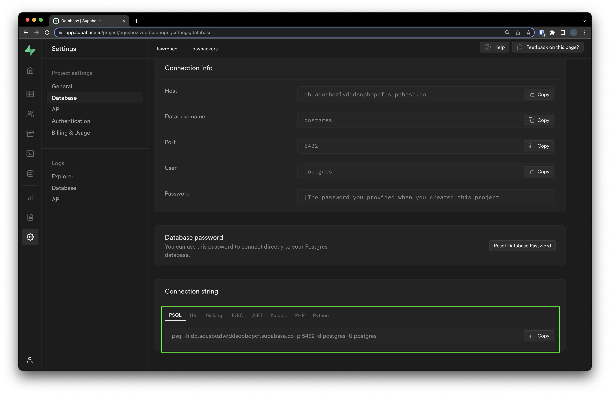

# `psql` introduction

> psql is a terminal-based front-end to PostgreSQL. It enables you to type in queries interactively, issue them to PostgreSQL, and see the query results. Alternatively, input can be from a file or from command line arguments. In addition, psql provides a number of meta-commands and various shell-like features to facilitate writing scripts and automating a wide variety of tasks.
> https://www.postgresql.org/docs/current/app-psql.html

## Installation

```bash
brew install libpq
```

If you need more help: https://stackoverflow.com/questions/44654216/correct-way-to-install-psql-without-full-postgres-on-macos

## Connect to Postgres

```bash
psql -h [HOSTNAME] -p [PORT] -U [USERNAME] -W -d [DATABASENAME]
```

or with a connecttion string

```bash
psql postgres://[USERNAME]:[PASSWORD]@[HOSTNAME]:[PORT]/[DATABASENAME]?sslmode=require
```

Find the connection string under Settings -> Database -> Connection String



## Forgotten password

The database password can be resetted by running this command in the SQL Editor:

```sql
alter user postgres with password 'NEW_PASSWORD';
```
